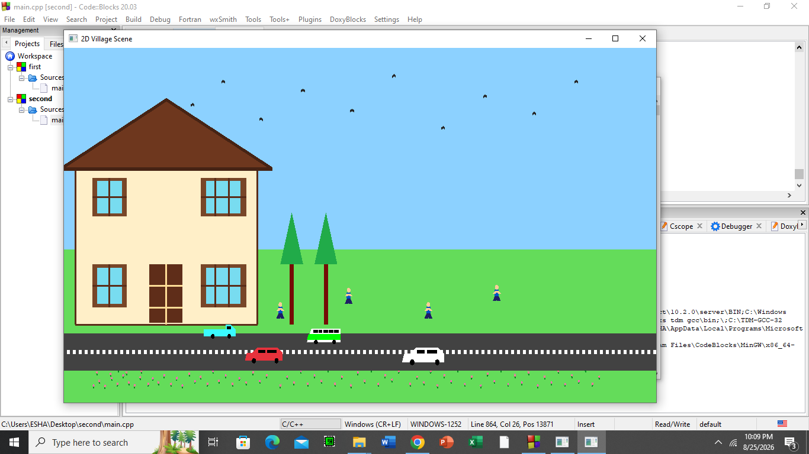

2D Village Scene
Project Description
This project is a 2D village scene made using C++ and OpenGL GLUT. It shows a simple colorful village environment with a house, road, grass, flowers, birds, humans, cars, a truck, and a bus.

The project also includes animation to make the scene more realistic and interesting.

Features
.2D village environment

.House with windows, door, roof, and trees

.Green grass and many flowers

.Road with road markings

.Moving birds in the sky

.Two moving cars

.Moving truck

.Moving bus

.Standing humans

.Object transformations using translation and scaling

.Continuous animation using GLUT timer function

Technologies Used
.C++

.OpenGL

.GLUT (OpenGL Utility Toolkit)

.CodeBlocks

Dependencies
The project requires:

.C++ compiler

.OpenGL

.GLUT / FreeGLUT

.CodeBlocks or another C++ IDE that supports OpenGL and GLUT

Setup Instructions:
1.Install CodeBlocks with a C++ compiler.

2.Install and configure OpenGL and GLUT/FreeGLUT.

3.Download or clone this GitHub repository.

4.Open the .cbp project file in CodeBlocks.

5.Make sure the GLUT/OpenGL libraries are correctly linked.

6.Open main.cpp.

How to Build
1.Open the project in CodeBlocks.

2.Open main.cpp.

3.Build the project using Build → Build.

4.If there are no errors, the project is ready to run.

How to Run
1.Open the project in CodeBlocks.

2.Build the project.

3.Click Build and Run or press F9.

4.The 2D Village Scene window will appear.

5.The birds and vehicles will move automatically.

Animation
The project uses the GLUT timer function to create continuous animation.

1.Birds move across the sky.

2.Cars move along the road.

3.The truck moves across the scene.

The bus moves across the scene.

4.Objects restart their movement when they reach the end of the scene.

Transformations
.The project uses OpenGL transformations such as:

.glTranslated() for moving objects

.glScaled() for changing object size

.glPushMatrix() and glPopMatrix() for controlling transformations

Output Preview
The output shows a colorful 2D village scene with a house, road, grass, flowers, humans, birds, cars, truck, and bus.

A screenshot of the running project is included in this repository.

Project File
.main.cpp — Main OpenGL/GLUT source code

.cbp file — CodeBlocks project file
.cpp file-codeBlocks project file

Screenshot — Preview of the project output

Conclusion
This project demonstrates basic 2D computer graphics using OpenGL GLUT. It uses different drawing primitives, colors, transformations, and animation techniques to create an interactive-looking village environment.
## Output Preview

